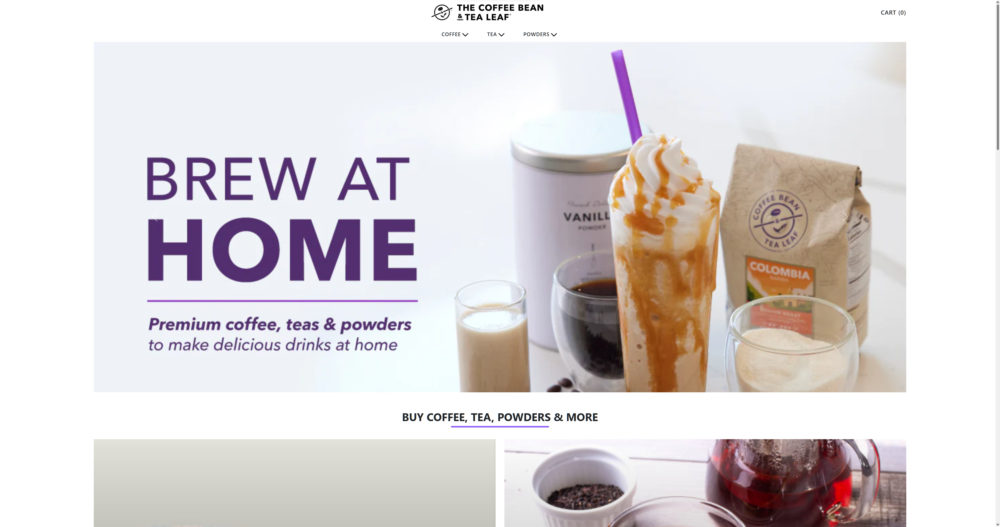

# Coffee Website



## Live Demo
You can access the live demo of the Coffee Website [here](https://coffee-yossef.vercel.app).

## Overview
This is a Coffee Website built using React, React Router DOM, Bootstrap, Tailwind CSS, React Redux, and Redux Toolkit. The website allows users to browse a variety of coffee products, add them to their cart, remove products from the cart, and clear the entire cart.

## Features
- **Add Products to Cart**: Users can easily add their favorite coffee products to the cart with a single click.

- **Remove Products from Cart**: If a user changes their mind or wants to remove a product from the cart, they can do so with a straightforward removal process.

- **Clear the Cart**: For added convenience, users can clear the entire cart in one go, removing all selected products.

- **Responsive design**: This website is fully responsive on all the devices.

## Technologies Used
- **React**: The website is built using React, a popular JavaScript library for building user interfaces.

- **React Router DOM**: React Router DOM is used for handling client-side routing, ensuring smooth navigation between different pages of the website.

- **Bootstrap**: Bootstrap is employed to enhance the website's styling and layout, making it responsive and visually appealing.

- **Tailwind CSS**: Tailwind CSS is utilized to fine-tune the website's design, providing custom styling and components.

- **React Redux**: React Redux is used for state management, making it easier to manage the cart and product data.

- **Redux Toolkit**: Redux Toolkit simplifies Redux configuration, making it more efficient and developer-friendly.

## Getting Started
1. Clone this repository:
   ```
   git clone https://github.com/yossefelnajjar/coffee-website.git
   ```

2. Install dependencies:
   ```
   npm install
   ```

3. Start the development server:
   ```
   npm run dev
   ```

4. Open your browser and navigate to `http://localhost:5173` to view the website.

## Usage
- Browse the coffee products and select the ones you like.
- Click the "Add to Cart" button to add products to your cart.
- Navigate to the cart page to view and manage your selected products.
- Use the "Remove" button to remove products from your cart.
- To clear the entire cart, click the "Clear Cart" button.
